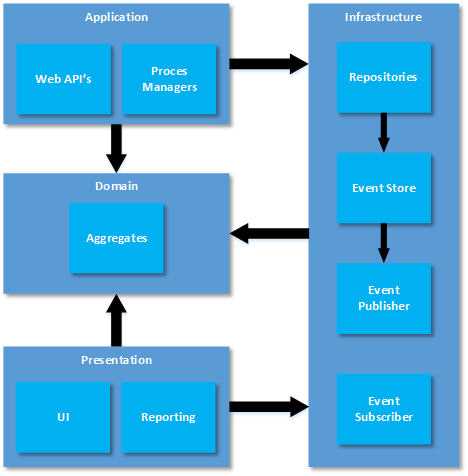
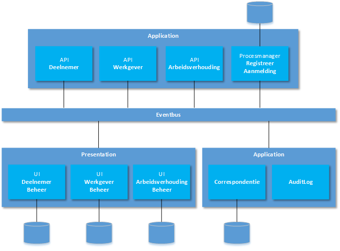

Pensioen Systeem
================
Deze solution bevat een voorbeeldimplementatie van een simpel proces in een 
Pensioensysteem dat loosely coupled is opgezet op basis van het CQRS pattern. 
In deze solution worden de volgende technieken / patterns gebruikt:

* DDD
* Onion architecture
* CQRS
* Event Sourcing
* Message Brokering (publish / subscribe)

Functionaliteit
---------------
De applicatie biedt ondersteuning voor het proces *Registreren Aanmelding* (dit 
is een deelproces in een bovenliggend bedrijfsproces dat in de demo verder 
buiten beschouwing wordt gelaten). Het proces treedt in werking wanneer een 
werknemer een dienstverband aangaat bij een werkgever. Dit wordt in het systeem 
geadministreerd d.m.v. het registreren van een *Arbeidsverhouding* tussen de 
*Werkgever* en de *Werknemer* (in het systeem een *Deelnemer* genoemd). Wanneer 
een aanmelding binnenkomt, wordt het proces gestart. De procesmanager zal eerst 
de werknemer registreren als deelnemer (aanname is dat de werknemer nog niet 
bestaat). Het systeem zal een uniek DeelnemerNummer genereren. Nadat de 
deelnemer is geregistreerd (*DeelnemerGeregistreerd* event), zal de 
procesmanager de werkgever registreren (aanname is dat de werkgever nog niet 
bestaat). Het systeem zal een uniek WerkgeverNummer genereren. Nadat de wekgever 
is geregistreerd (*WerkgeverGeregistreerd* event), zal de procesmanager een 
arbeidsverhouding tussen de werkgever en werknemer registreren. Het systeem zal 
een uniek ArbeidsverhoudingNummer genereren. Als de arbeidsverhouding is 
geregistreerd (*ArbeidsverhoudingGeregistreerd* event), zal de procesmanager 
melden aan het bovenliggende bedrijfsproces dat het deelproces *Registreren 
Aanmelding* afgerond is.

Naast ondersteuning voor het proces *Registreren Aanmelding* biedt de applicatie 
ook ondersteuning voor het vastleggen van de verhuizing van een deelnemer. Dit 
kan worden gedaan door in de UI.Deelnemer applicatie (zie componenten) een 
deelnemer te selecteren in het overzicht en dan uit het menu de optie 
'Deelnemer' en vervolgens de optie 'Verhuis' te kiezen. Bij een wijziging van 
het adres zal een *VerhuisDeelnemer* command worden verstuurd. Dit zal worden 
verwerkt en zal leiden tot de publicatie van een *DeelnemerVerhuisd* event. Dit 
event zal weer worden opgepakt door de UI.DeelnemerBeheer applicatie en de data 
zal worden bijgewerkt in de database. Daarna wordt het overzichtscherm met 
deelnemers worden ververst met de nieuwste gegevens. Het event zal tevens worden 
opgepakt door de Application.Correspondentie applicatie. Deze applicatie zal op 
basis van de gegevens van de deelnemer (en het nieuwe adres) een brief aanmaken 
waarin de desbetreffende deelnemer op de hoogte wordt gebracht van het feit dat 
de verhuizing is verwerkt in de administratie. 

Domeinen
--------
Binnen het systeem zijn de volgende 3 domeinen geïdentificeerd:

* Deelnemer
* Werkgever
* Arbeidsverhouding

Elk domein is samengesteld uit 1 of meerdere aggregates waarbij slechts 1 
aggregate als aggregate-root fungeert (DDD). De volgende aggregates zijn 
geïdentificeerd:

**Deelnemer domein**

* Deelnemer (aggregate root)
* Adres (value object)  

**Werkgever domein**

* Werkgever (aggregate root)  
* Adres (value object)

**Arbeidsverhouding domein**

* Arbeidsverhouding (aggregate root)

**LET OP**: de gekozen domeinen komen prima uit voor het voorbeeld-scenario. 
Neem dit echter niet als uitgangspunt voor het bepalen bounded-contexts, 
aggregates en aggregate-roots wanneer DDD wordt ingezet voor een daadwerkelijk 
project. Doe daarom altijd de volledige analyse met de domeinexperts om tot een 
goed model te komen.

Lagen
-----
De applicatie bevat de volgende lagen (de naam van de laag is opgenomen in de 
namespace van de verschillende componenten van de applicatie):

* Domain - het domein model. Hierin bevindt zich alle business-logica en worden 
  alle mutaties vastgelegd.De domain laag is volledig autonoom. Er zijn geen 
  afhankelijkheden (en dus referenties) naar andere lagen in de applicatie. 
  Binnen deze laag worden (per domein) ook alle mogelijk commands en events 
  gedefinieerd.
* Application - de applicatielaag. Hierin bevinden zich Web API's, 
  procesmanagers en utilities. De Web API's ontvangen commands die vervolgens 
  worden uitgevoerd door aggregates in de domain laag. De procesmanagers 
  coördineren systeemprocessen die bestaan uit meerdere stappen die 
  verschillende domeinen raken. Utilities zijn allerlei applicaties die bepaalde 
  functionaliteit uitvoeren (bijvoorbeeld Application.Correspondentie voor het 
  versturen van brieven e.d.). De application laag vormt tevens de lijm tussen 
  de domain laag en de infrastucture laag.
* Infrastructure. Deze laag bevat infrastructurele componenten. Denk daarbij aan 
  repositories en eventstore implementaties (voor het persisteren van events), 
  eventpublisher implementaties voor het publiceren van events aan de rest van 
  het systeem (en daarbuiten) via een eventbus.
* Presentation. Deze laag bevat schermen voor eindgebruikers (UI) en rapportages 
  (op dit moment nog niet geïmplementeerd in de demo).

Componenten
-----------
De applicatie bestaat uit de volgende componenten:

**Domain laag**

* PensioenSysteem.Domain.Core - Bevat de interfaces en baseclasses die worden 
  gebruikt door de verschillende domeinen.  
* PensioenSysteem.Domain.Deelnemer - Bevat de functionaliteit van het Deelnemer 
  domain.  
* PensioenSysteem.Domain.Werkgever - Bevat de functionaliteit van het Werkgever 
  domain.  
* PensioenSysteem.Domain.Arbeidsverhouding - Bevat de functionaliteit van het 
  Arbeidsverhouding domain.  

**Application laag**

* PensioenSysteem.Application.Deelnemer - Bevat de Web API om commands naar het 
  Deelnemer domein te versturen.  
* PensioenSysteem.Application.Werkgever - Bevat de Web API om commands naar het 
  Werkgever domein te versturen.  
* PensioenSysteem.Application.Arbeidsverhouding - Bevat de Web API om commands 
  naar het Arbeidsverhouding  domein te versturen.  
* PensioenSysteem.Application.Correspondentie - Bevat functionaliteit voor het 
  genereren van brieven e.d.
* PensioenSysteem.Application.ProcesManagers - Bevat procesmanagers voor de 
  systeemprocessen binnen de applicatie.  
* PensioenSysteem.Application.AuditLog - Bevat een eventsubscriber die alle 
  events die gepubliceerd worden ontvangt en vastlegt in een log.    

**Presentation laag**

* PensioenSysteem.UI.DeelnemerBeheer - Bevat een UI voor het inzien en beheren 
  van deelnemer gegevens. De gegevens worden gelezen uit een SQL Server 
  database. Deze database wordt gevuld door events die te maken hebben met 
  deelnemers te ontvangen en op basis daarvan de database bij te werken. Deze 
  eventsubscriber leeft in de UI applicatie (hiervoor wordt de 
  Infrastructure.RabbitMQDomainEventHandler class gebruikt (zie componenten in 
  de Infrastructure laag)).  
* PensioenSysteem.UI.WerkgeverBeheer - Vergelijkbaar met de bovengenoemde UI 
  voor deelnemergegevens, maar dan voor gegevens die te maken hebben met 
  werkgevers.  
* PensioenSysteem.UI.ArbeidsverhoudingBeheer - Vergelijkbaar met de 
  bovengenoemde UI voor deelnemergegevens, maar dan voor gegevens die te maken 
  hebben met arbeidsverhoudingen.  

**Infrastructure laag** 
 
* PensioenSysteem.Infrastructure - Bevat de volgende infrastructurele 
  componenten:
    * EventSourcedAggregateRepository - implementatie van de 
      IAggregateRepository interface (uit Domain.Core) waarbij voor de opslag 
      van de aggregates gebruikgemaakt wordt van EventSourcing (zie 
      FileEventStore)).
    * FileEventStore - implementatie van de IEventStore interface (uit 
      Infrastructure) die events persisteert op filesystem.
    * RabbitMQEventPublisher - implementatie van de IEventPublisher interface 
      (uit Domain.Core) die RabbitMQ gebruikt voor het publiceren van events.
    * RabbitMQDomainEventHandler - implementatie van een subscriber die events 
      die via RabbitMQ worden gepubliceerd ontvangt en een callback aanroept 
      voor het afhandelen van deze events.

In de demo applicatie bevinden alle componenten zich in 1 solution. Dit is 
vooral vanwege het ontwikkelgemak. Elk component kan in een eigen solution 
worden gestopt. In dat geval moet er wel een alternatief gebruikt worden voor 
de project-references tussen de verschillende componenten.

Logische solution architectuur
------------------------------
De logische solution architectuur is als volgt opgebouwd:

Technische implementatie
------------------------
**Error handling**  
In de applicatie is minimaal errorhandling geïmplementeerd. Er worden amper 
exceptions gevangen en om dit scenario meer productierijp te maken, zal dit 
alsnog moeten gebeuren. Ook is nergens gebruikgemaakt van retry mechanismen om 
zaken die stukgaan opnieuw te proberen. De RabbitMQ broker heeft wel een retry 
mechanisme ingebouwd. Als een bericht (event) dat van de broker is ontvangen 
niet binnen een bepaalde (configureerbare) time-out expliciet door de ontvanger 
wordt afgemeld (door een ack naar de broker te sturen), zal het bericht opnieuw 
beschikbaar komen in de queue.

**Event Sourcing**  
EventSourcing is in de demo applicatie minimaal geïmplementeerd. De 
implementatie bestaat uit het simpelweg serialiseren van de event-data en deze 
(per aggregate) in een bestand op disk plaatsen. 

**Proces managers**  
In de demo applicatie bevindt zich slechts 1 procesmanager: 
Application.ProcesManagers.RegistrerenAanmelding. Dit is een demo implementatie 
van een procesmanager. Persistence is geïmplementeerd middels een tabel in SQL 
Server. Dus als het proces crasht, blijft de administratie rondom de lopende 
processen aanwezig en zullen events die nog in de queue staan voor nog lopende 
worden afgehandeld zodra de procesmanager weer wordt gestart.

**Transactie Management**  
Binnen de applicatie wordt geen rekening gehouden met het feit dat het opslaan 
van gegevens en het publiceren van een event gezamelijk in 1 transactie moeten 
worden uitgevoerd. De volgorde die is gekozen, is dat eerst het event wordt 
gepubliceerd en daarna de state van een aggregate wordt opgeslagen. 

Dat wil zeggen dat wanneer dus publiceren van het event mislukt, de state van de 
aggregate niet zal worden aangepast. Echter, als het publiceren van het event 
lukt maar het opslaan van de aggregate state niet, zal het event wel door 
subscribers worden ontvangen. Dit is in principe geldig aangezien de validatie 
of de mutatie die het event tot gevolg heeft doorgang mag vinden in een eerder 
stadium al heeft plaatsgevonden. Het feit dat de nieuwe state niet kan worden 
opgeslagen kan dan slechts door een technisch probleem worden veroorzaakt. Omdat 
alle events worden bijgehouden is het dus mogelijk om de state van de aggregate 
opnieuw op te bouwen en alsnog te persisteren zodra de technische probleem is 
verholpen. Dit is uiteraard wel een beheer activiteit en geen onderdeel van de 
standaard applicatiefunctonaliteit.

In een productiescenario is het wel raadzaam om middels 2PC transacties of 
middels een Unit Of Work pattern het publiceren van het event en het bijwerken 
van de aggregate state atomair te maken.

Producten en frameworks
-----------------------
De volgende producten en frameworks zijn ingezet binnen de applicatie:

* ASP.NET Web API - voor het leveren van een REST API op een domain voor het 
  verwerken van commands.
* ASP.NET Web API Client - voor het aanroepen van de REST API's.
* Newtonsoft JSon.NET - voor de serializatie van gegevens naar JSON.
* Dapper - voor het vullen van de databases vanuit de UI componenten.
* RabbitMQ - voor het publiceren van events.
* SQL Server - voor het opslaan van gegevens voor de readmodels van de 
  verschillende UI componenten.
* PDFSharp - voor het genereren van brieven.

Installatie en configuratie
---------------------------
Om de applicatie te kunnen draaien moeten de volgende zaken geregeld worden:

**RabbitMQ**    
RabbitMQ wordt gebruikt als broker voor events. Zie de 
[website van RabbitMQ](http://www.rabbitmq.com) voor meer informatie over hoe 
RabbitMQ geinstalleerd en geconfigureerd moet worden.

De onderstaande stappen moeten uitgevoerd worden om RabbitMQ te installeren en 
configureren. LET OP: er is ook een export bestand beschikbaar dat de resultaten 
van alles van stap 4 en verder bevat. Dit bestand kan via de import functie op 
de RabbitMQ management portal worden ingelezen. Het bestand 
(*RabbitMQDefinitons.json*) is opgenomen als solution-item in de Visual Studio 
solution.

1. Installeer Erlang
2. Installeer RabbitMQ 
3. Activeer de management plugin
4. Maak een (niet admin) gebruiker aan genaamd 'cqrs_user' met password 
   'SeeQueErEs'.
5. Geef deze gebruiker rechten om te lezen en schrijven op virtual host '/'.
6. Defnieer een durable Exchange genaamd 'PensioenSysteem' (dit noemen we vanaf 
   nu de 'PSX').
7. Definieer een durable queue 'PensioenSysteem.Deelnemer' en bind deze aan de 
   PSX met routing key 'Deelnemer.#'.
8. Definieer een durable queue 'PensioenSysteem.Werkgever' en bind deze aan de 
   PSX met routing key 'Werkgever.#'.
9. Definieer een durable queue 'PensioenSysteem.Arbeidsverhouding' en bind deze 
   aan de PSX met routing key 'Arbeidsverhouding.#'.
10. Definieer een durable queue 'PensioenSysteem.RegistreerAanmelding' en bind 
    deze 3 maal aan de PSX met de volgende routing keys: 
    * 'Deelnemer.Geregistreerd'
    * 'Werkgever.Geregistreerd'
    * 'Arbeidsverhouding.Geregistreerd'
11. Definieer een durable queue 'PensioenSysteem.Werkgever' en bind deze aan de 
    PSX met routing key 'Werkgever.#'.
12. Definieer een durable queue 'PensioenSysteem.Arbeidsverhouding' en bind deze 
    aan de PSX met routing key 'Arbeidsverhouding.#'.
13. Definieer een durable queue 'PensioenSysteem.Correspondentie' en bind deze 
    aan de PSX met routing key 'Deelnemer.#'.
14. Definieer een durable queue 'PensioenSysteem.AuditLog' en bind deze aan de 
    PSX met routing key '#'.

**SQL Server**  
Er moet een SQL Server beschikbaar zijn (SQL Express is voldoende). De standaard 
servernaam die wordt gebruikt in connectionstrings is '.\sqlexpress'. Als een 
andere database server wordt gebruikt, dan moet in de App.config van de 
Pensioenbeheer.UI.* projecten 2 connectionstrings aangepast worden zodat de 
juiste SQL Server naam wordt gebruikt.

De volgende 4 databases moeten aanwezig zijn: ArbeidsverhoudingBeheer, 
DeelnemerBeheer, WerkgeverBeheer, Creespondentie en ProcesManagement. Voer de 
volgende SQL scripts uit voor het aanmaken van deze databases en de bijbehorende 
logins en users:

* PensioenSysteem.UI.ArbeidsverhoudingBeheer\sql\ArbeidsverhoudingBeheer.sql
* PensioenSysteem.UI.DeelnemerBeheer\sql\DeelnemerBeheer.sql
* PensioenSysteem.UI.WerkgeverBeheer\sql\WerkgeverBeheer.sql
* PensioenSysteem.Application.Correspondentie\sql\Correspondentie.sql
* PensioenSysteem.Application.ProcesManagers\sql\ProcesManagement.sql

Na het aanmaken van de databases moet het password van de aangemaakt logins 
(ArbeidsverhoudingBeheerUser, DeelnemerBeheerUser, WerkgeverBeheerUser, 
Correspondentieuser en ProcesManagementUser gereset worden naar 
'S3cretP@$$w0rd').

**Filesystem**  
Binnen de applicatie wordt gebruikgemaakt van 3 folders:

* Correspondentie folder - deze folder wordt gebruikt om gegenereerde brieven 
  e.d. op te slaan.
* AuditLog folder - deze folder wordt gebruikt om AuditLog bestanden te 
  plaatsen. De standaard folder is 'd:\PensioenSysteem\AuditLog'. De folder is 
  te configureren in de App.Config van het Application.AuditLog component. 
* EventStore folder - deze folder wordt gebruikt om events te persisteren. De 
  standaard folder is 'd:\PensioenSysteem\EventStore'. De folder is te 
  configureren in de App.Config van de volgende componenten:
    * Application.Deelnemer
    * Application.Werkgever
    * Application.Arbeidsverhouding
 
Test Handleiding
----------------
Om de applicatie te testen is het voldoende om de solution te openen in Visual 
Studio en te starten (F5). Standaard staan er meerdere projecten als startup 
project geconfigureerd. De volgende projecten worden gestart (in debug mode):

* PensioenSysteem.Application.Arbeidsverhouding
* PensioenSysteem.Application.Deelnemer
* PensioenSysteem.Application.Werkgever
* PensioenSysteem.Application.AuditLog
* PensioenSysteem.Application.Correspondentie
* PensioenSysteem.Application.ProcesManagers
* PensioenSysteem.UI.Arbeidsverhoudingbeheer
* PensioenSysteem.UI.DeelnemerBeheer
* PensioenSysteem.UI.WerkgeverBeheer

De eerste 3 projecten zijn web-projecten en daarvoor zal dus deze zullen in een 
IIS Express gehost worden. Voor deze appicaties zal een browserwindow 
verschijnen.

Het is handig om de verschillende windows die worden getoond (m.u.v. de browser 
windows) enigzins naast elkaar op het scherm te plaatsen.

De applicatie kan getest worden door een *Registreer Aanmelding* proces te 
starten. Dit kan op het console window van Application.ProcesManagers. Door hier 
op een toets te klikken, wordt er een proces gestart. Dit kan meerdere keren 
(totdat de Esc toets wordt ingedrukt). 

Controleren of alles werkt kan door de verschillende windows in de gaten te 
houden. In het auditlog moeten alle events langekomen. In de 3 UI applicaties 
moeten Deelnemers, Werkgevers en Arbeidsverhoudingen verschijnen en in de 
AuditLog en EventStore folders moeten bestanden verschijnen.  

Door in UI.Delnemer en deelnemer te selecteren en dan uit het menu de optie 
'Deelnemer' en vervolgens de optie 'Verhuis' te kiezen, kan een nieuw adres 
worden ingevoerd. Als dit wordt bevestigd moet in het 
Application.Correspondentie window een melding verschijnen dat er een brief 
i.v.m. verhuizing is verzonden. In de Corespondentie folder moet vervolgens ook 
een PDF bestand zijn verscheven met daarin de gegevens van de deelnemer en 
informatie over de verhuizing (bestandsnaam begint met de datum en tijd gevolgd 
door de naam van de deelnemer).

Disclaimer
----------
Zoals in verschillende bovenstaande paragrafen reeds aangegeven, is dit echt een 
typische demo-applicatie die niet zonder meer kan worden ingezet in een 
productieomgeving. Het is vooral bedoeld om de principes van CQRS, eventing en 
event-sourcing te demonstreren. Delen van de applicatie kunnen hergebruikt 
worden, maar niet zonder eerst te analyseren en de applicatie aan te passen om 
de voor de doelsituatie benodigde robuustheid te kunnen leveren. Denk daarbij 
testbaarheid van de code en het toevoegen van errorhandling, transaction 
support, security, enzovoorts.

De code van deze applicatie is open-source en mag door eenieder hergebruikt 
worden (gepubliceerd onder de Apache 2.0 license). De auteur kan nooit 
aansprakelijk worden gesteld door directe of indirecte schade die wordt geleden 
door het gebruik (delen van) van de code.

Edwin van Wijk - edwinvw@gmail.com
